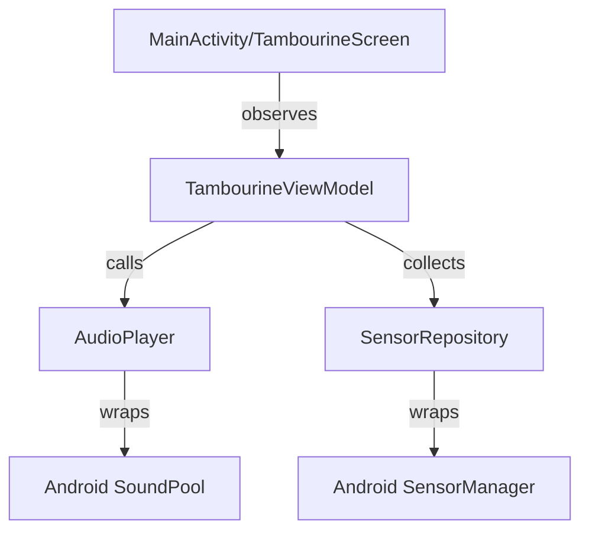

<p align="center">
  <br>
  <a href="https://play.google.com/store/apps/details?id=appinventor.ai_grmapal2.pandereta">
    
  </a>
</p>

# Pandereta (Tambourine App)

[](https://github.com/yourusername/Pandereta/actions/workflows/ci.yml)
[](https://opensource.org/licenses/MIT)
[](https://kotlinlang.org)
[](https://developer.android.com/jetpack/compose)

Pandereta is a native Android application developed using **Jetpack Compose** that simulates a virtual tambourine. It plays realistic tambourine sounds triggered either by tapping on the screen or by shaking the device.

---

## 📖 Table of Contents
- [Features](#-features)
- [Architecture](#-architecture)
- [Prerequisites](#-prerequisites)
- [Installation](#-installation)
- [Configuration](#-configuration)
- [Usage](#-usage)
- [License](#-license)

---

## ✨ Features
- **Shake-to-Play:** Utilizes the accelerometer sensor to calculate 3D motion magnitude with software gravity filtration for precise shaking audio response in any orientation.
- **Low-Latency Audio:** Employs Android `SoundPool` for optimized, instant sound rendering.
- **Visual Feedback:** Responsive tambourine illustration rotates smoothly in response to device tilts using a low-pass smoothing filter.
- **Modern Jetpack Compose UI:** Material Design 3 styling, Edge-to-Edge display, and dynamic dark mode color scheme.
- **MVVM Architecture:** Clean, decoupled design separating sensor streams, audio layers, and Composable views.

---

## 🏗️ Architecture



- **SensorRepository:** Encapsulates the `SensorEventListener` and stream-emits raw values via Kotlin `Flow` callbackFlow.
- **AudioPlayer:** Coordinates loading audio assets and managing standard `SoundPool` stream playback.
- **TambourineViewModel:** Performs gravity filter calculation, shake threshold validations, and exposes rotation and load status states.

---

## 🛠️ Prerequisites
- **Android Studio** Jellyfish (2023.3.1) or newer.
- **JDK 17** installed and configured in your environment.
- **Android SDK** API level 24 (Android 7.0 Nougat) or higher.

---

## 🚀 Installation
1. Clone the repository:
   ```bash
   git clone https://github.com/yourusername/Pandereta.git
   cd Pandereta
   ```
2. Open the project in **Android Studio**.
3. Let Gradle sync and download required dependencies.
4. Run the application on your physical device or emulator using Android Studio run button or CLI:
   ```bash
   ./gradlew installDebug
   ```

---

## ⚙️ Configuration
The project is configured out-of-the-box. Local properties can be specified in `local.properties`. 

Refer to [local.properties.example](local.properties.example) and [.env.example](.env.example) templates to configure release signing parameters or custom API keys without committing actual secrets.

---

## 📱 Usage
- **Tap to play:** Tap the tambourine icon on the screen to play a membrana/drum hit sound.
- **Shake to play:** Shake your phone in any direction. The app evaluates linear acceleration and plays shake jingle sound effects matching your shaking strength.
- **Tilt for orientation:** Tilt your device left or right to see the tambourine icon tilt responsively.

---

## 📄 License
Distributed under the MIT License. See `LICENSE` for more information.
